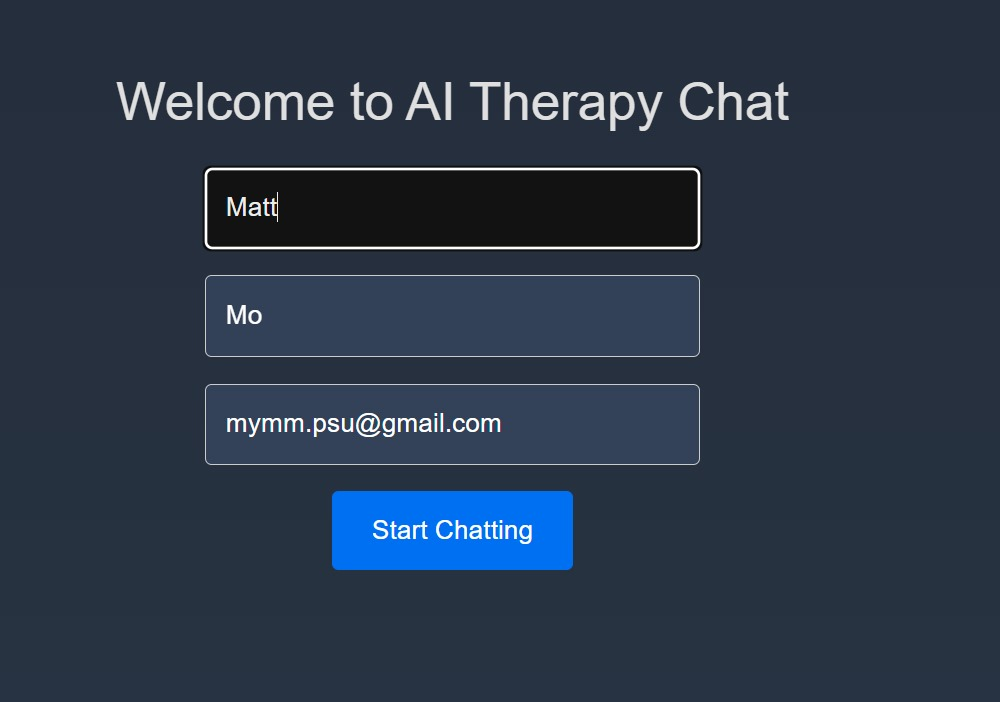
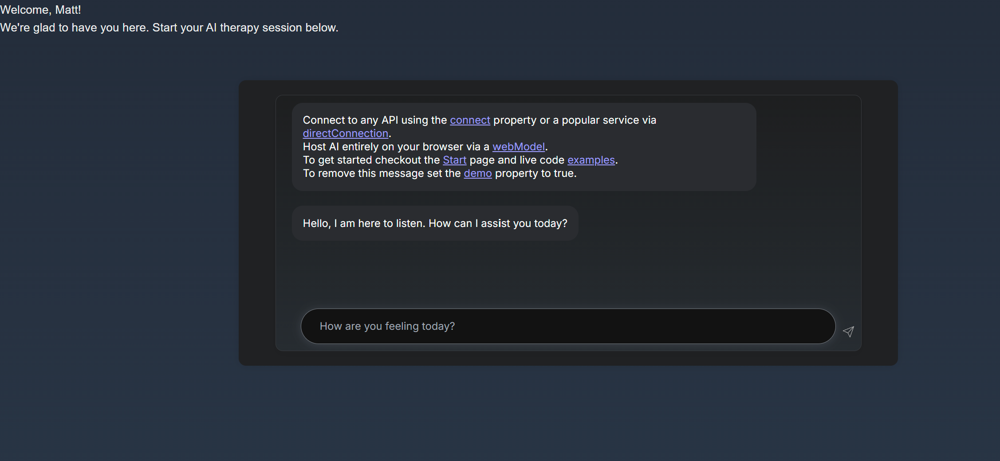

## AI Chat Therapy Application

# Development
## To-do
* integrate deepchat component to custom API application 
  To do so, adjust 
* 1. Components: (src/components/ChatInterface.tsx)
* 2. Ensure backend API format given this example in [Flask](https://github.com/OvidijusParsiunas/deep-chat/tree/main/example-servers/python/flask)

## User flow

1. User logs in to fill out basic information through a form

2. User may begin chatting

3. Other tabs include
    - Subscription 
    - Login